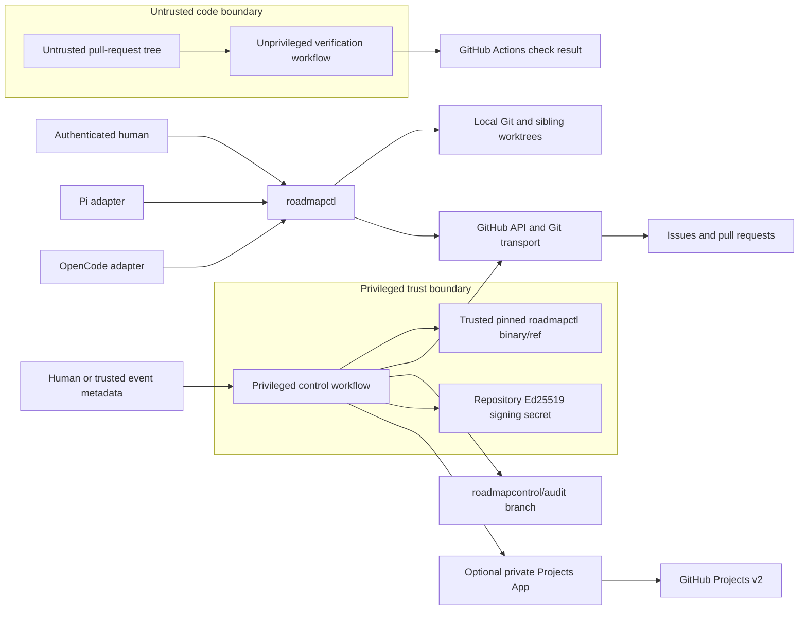

# Architecture and Canonical Storage

## Goals and constraints

This design implements only the approved first-release loop: approve roadmap work, select it through an explicit queue, create a bounded task workspace, deliver task and tracker pull requests, synchronize derived GitHub views, audit control decisions, and promote a verified release. It adds no hosted service, telemetry, autonomous prioritization, cross-repository coordination, or additional agent adapters.

The following constraints shape every decision:

- `.roadmap/` is canonical for current approved work; Issues retain discussion/evidence history and Projects remain derived.
- Unknown authority or required evidence fails closed globally unless the affected scope can be proven.
- Git and GitHub are durable authority. Local SQLite is disposable.
- GitHub writes, Projects writes, local lock changes, and Git commits are not one atomic transaction.
- GitHub Actions availability and billing visibility are external dependencies.
- Normal pull requests allow at most 400 authored additions plus deletions.
- Technical controls must not imply protection against a malicious repository owner or local host owner.

## System context and trust boundaries



| Boundary | Trusted for | Explicitly not trusted for |
| --- | --- | --- |
| Canonical default/tracker branches | Reviewed roadmap and integrated code at exact Git object IDs | Unreviewed pull-request content or mutable branch names alone |
| Privileged control workflow | Repository-scoped mutations and audit signing from trusted code | Building or executing pull-request code |
| Unprivileged verification workflow | Producing check evidence for an exact base/head pair | Secrets, promotion authority, merge authority, or audit signing |
| `GITHUB_TOKEN` | Ephemeral repository-scoped Issue, pull-request, ref, and check operations | Projects v2 access, cross-repository authority, or guaranteed recursive event delivery |
| Optional Projects App | Projects v2 field read/write for the installed repository/project | Contents/code write, pull-request merge, or audit signing |
| Local CLI and adapter | Cooperative enforcement for the authenticated identity and worktree | Resistance to a malicious machine owner or a process bypassing the CLI |
| Repository owner | Ultimate GitHub administration and break-glass recovery | An actor RoadmapControl can technically prevent from deliberate bypass on GitHub Free |
| GitHub and Git object storage | Durable source evidence when object IDs, signatures, and history agree | Atomicity across APIs, immediate consistency, or unlimited Actions availability |
| Engram through Pi | User-controlled Pi context persistence during handoff | Roadmap authority or a RoadmapControl-operated backend |

Pull-request code never receives the audit private key, Projects App private key, release credentials, or a write-capable control token. `pull_request_target` is prohibited. A privileged job checks out only an allowlisted trusted commit or downloads a release artifact whose digest and signature match the installed pin.

## Repository and Go package layout

The repository is one Go module, `github.com/AndySabina/RoadmapControl`. It produces one primary binary, `roadmapctl`. First-release packages remain under `internal/`; no public Go API is promised.

```text
cmd/roadmapctl/                 CLI composition root and subcommands
internal/app/                   Use cases, authorization orchestration, transactions
internal/domain/
  roadmap/                      Hierarchy, identifiers, dependencies, queue, progress
  execution/                    Admission, leases, grants, sessions, handoff
  delivery/                     PR topology, line budget, tracker/release gates
  synchronization/             Outbox, projections, drift, reconciliation
  audit/                        Canonical events, hash chain, signatures, key rotation
  lifecycle/                    Install, update, uninstall, reconstruction
internal/ports/                 Interfaces for clock, identity, Git, GitHub, signer, cache
internal/adapters/
  git/                          Object/ref operations, worktrees, diff accounting
  github/                       REST/GraphQL client using ephemeral credentials
  projects/                     Optional App-backed Projects v2 adapter
  filesystem/                   YAML modules, locks, managed blocks
  cache/                        Rebuildable SQLite projections
  agent/pi/                     Pi capability/session adapter
  agent/opencode/               OpenCode capability/session adapter
internal/policy/                Protected surfaces, roles, workflow/rule classification
schemas/roadmap/v1/             Root and referenced versioned JSON Schemas
migrations/                     One directory per explicit source-to-target migration
.github/workflows/              Privileged control and unprivileged verification workflows
.roadmap/                       Installed canonical roadmap and public audit keys
```

`domain` packages are deterministic and have no filesystem, network, Git, GitHub, environment, or wall-clock dependencies. `app` owns use-case ordering and passes explicit clock values, authenticated actor facts, expected object IDs, and operation IDs into the domain. Adapters translate external evidence but do not decide policy. This keeps state-machine tests independent of GitHub and lets the CLI and Actions use the same rules.

No adapter may import another adapter. Domain packages may share small value types but not call application services. All remote mutation interfaces require an expected canonical roadmap version and an idempotency key.

## Canonical roadmap storage

### Modular YAML layout

```text
.roadmap/
  roadmap.yaml                  Schema pin, repository identity, policy references
  policy.yaml                   Roles, promotion, branches, versions, protected surfaces
  queue.yaml                    Sole operational ordering: ordered task IDs
  identifiers.yaml              High-water marks and immutable active/retired registry
  trackers/
    R-000001/
      tracker.yaml
      phases/P-000001.yaml      Optional
      subphases/S-000001.yaml   Optional
      tasks/T-000001.yaml
  keys/audit/<key-id>.pub       Public Ed25519 keys and metadata
  installation.yaml             Exact RoadmapControl release and workflow pins
```

`roadmap.yaml` pins one schema URI/version and lists module paths. Module discovery is not implicit: unlisted YAML is rejected, missing listed YAML is rejected, and paths are normalized repository-relative paths. Parsing rejects duplicate YAML keys, aliases that exceed bounded expansion, unknown fields, non-UTF-8 input, and ambiguous scalar coercion. Modules are decoded to typed values, then re-encoded to canonical JSON for hashing and schema validation. Tracker types validate against the five built-ins (`feature`, `bug`, `maintenance`, `security`, and `documentation`) plus the exact additional values declared by an owner in `policy.yaml`; undeclared values fail validation.

The assembled snapshot is validated as one aggregate. Its version is:

```text
roadmap_digest = SHA-256(canonical JSON of the assembled roadmap)
roadmap_version = <merge-commit-object-id>:<roadmap_digest>
```

The merge commit distinguishes two approved merges with identical content. Durable operations bind both components; a mutable branch name is never sufficient evidence.

### Schemas and migrations

`schemas/roadmap/v1/schema.json` is the version entry point and uses only relative `$ref` files beneath the same version directory. Schemas are bundled into the binary for deterministic offline validation; installed files are checked against digests in `installation.yaml`. Network schema resolution is forbidden.

Each migration directory is immutable after release:

```text
migrations/v1-to-v2/
  manifest.yaml                 Source/target, binary range, migration digest
  migrate.go                    Pure typed transformation
  fixtures/                     Before/after compatibility examples
```

`roadmapctl migrate plan` reads an exact source tree and writes a proposed target tree only on a new branch. It emits a report containing changed paths, source/target schema versions, and before/after digests. It never edits the approved branch in place or merges the migration. Unsupported source versions fail before any write.
