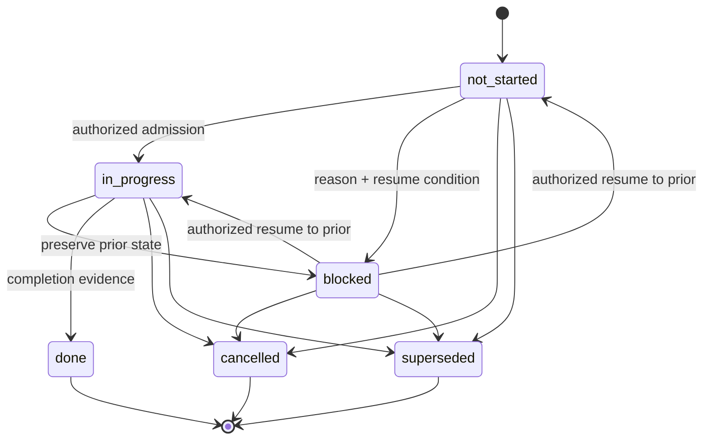

# Domain Model and Execution Control

## Domain model and invariants

### Aggregates

| Aggregate | Root and members | Transaction boundary |
| --- | --- | --- |
| Roadmap | Repository identity, policy, identifier registry, trackers, hierarchy, dependencies, queue | Entire assembled `.roadmap/` snapshot for validation/promotion |
| Task execution | Task ID, signed lease, branch/ref binding, grant, session, checkpoint/handoff state | One task, additionally checked against active-task scope index |
| Tracker delivery | Tracker branch, draft tracker PR, child task PRs, verification evidence | One tracker |
| Release | Logical development revision, production target, version policy, checks, human decision | One release candidate |
| Synchronization | Roadmap version, target projections, outbox states, freeze/reconciliation | One roadmap version and its affected target scopes |
| Audit chain | Sequence, previous hash, event payload/evidence hashes, key ID, signature | One append to the audit branch |
| Installation | Repository fingerprint, release pins, rule inventory, managed block hashes, lifecycle state | One installed repository |

Cross-aggregate operations are application-level sagas. No code pretends that a GitHub ref write, Issue update, Project update, and audit append commit together.

### Identifiers

Identifiers use `R-`, `P-`, `S-`, and `T-` plus six uppercase decimal digits. `identifiers.yaml` stores a per-prefix high-water mark and an append-only registry entry containing ID, kind, first-approved roadmap version, stable parent ID where applicable, Issue association where required, and retired status. Removing or terminally superseding work retires the ID; it never makes the ID reusable.

Batch allocation is deterministic:

1. Validate and normalize allocation intents.
2. Sort intents by `(kind, parent-id, issue-number, normalized-title)`.
3. Starting at the persisted high-water mark, assign the next number per prefix.
4. Write registry and node modules in the same roadmap pull request.
5. At merge validation, compare the proposal's registry base digest with the current canonical digest.

Concurrent proposals can therefore request the same next ID, but only the first current-base proposal can merge. The other fails stale-base validation and must be explicitly regenerated; RoadmapControl does not silently renumber reviewed content.

Identity immutability is checked against the current and retired registry, not only the current YAML tree. Tracker and task Issue associations are mandatory. Phase and subphase Issue associations are optional and do not participate in identity or approval inference.

### State machines



The only state values are `not_started`, `in_progress`, `blocked`, `done`, `cancelled`, and `superseded`. `done`, `cancelled`, and `superseded` are terminal and reject every subsequent transition. A blocked record contains `prior_state`, non-empty reason, non-empty resume condition, blocking actor, and roadmap version. Resume can return only to the recorded prior state after an authorized actor records how the resume condition was met.

Tasks hold explicit state. Parent state is derived from all descendant tasks unless an authorized override supplies a non-empty justification and audit reference. Cancelled and superseded tasks are excluded from both numerator and denominator. For included tasks:

- progress is `done_count / included_count`, with equal weight;
- zero included tasks yields undefined progress and derived `not_started`, not a false 100%;
- all included tasks done derives `done`;
- any `in_progress`, or a mixture of done and not-started work, derives `in_progress`;
- otherwise any blocked task derives `blocked`;
- otherwise the result is `not_started`.

An override is evidence, not a mutation of child states. Once an explicitly overridden parent reaches a terminal state, that parent state is immutable. Validators report the derived and overridden values together so exceptional state cannot hide underlying progress.

### Dependencies and queue selection

The dependency graph contains every hierarchy node. An edge points from a dependent node to the node it requires. Validation rejects unknown IDs, self-edges, duplicate edges, and cycles using a stable lexical traversal so diagnostics are reproducible. A task's effective dependencies are the union of its direct dependencies and those declared by each ancestor. A dependency is satisfied only when the target's explicit or derived state is `done`; cancelled, superseded, blocked, or unknown dependencies are unsatisfied.

`queue.yaml` is an ordered list of unique task IDs. RoadmapControl never derives priority, sorts the queue, or inserts work based on metadata. `next` scans entries in file order and returns the first task that passes all admission predicates. It records deterministic rejection reasons for skipped entries but does not alter their order. Admission re-evaluates the same predicates against the exact canonical version immediately before lease issuance:

1. task is present in the approved roadmap and queue;
2. task is non-terminal, not already active, and dependency-ready;
3. assignment resolves to the authenticated authorized GitHub identity;
4. outcome criteria and repository-relative allowed paths are non-empty;
5. quota permits admission;
6. default/global WIP and configured role policy permit another active task;
7. allowed paths do not overlap active scopes and do not intersect protected surfaces;
8. synchronization and audit evidence for the task's roadmap version are complete.

Missing or stale evidence denies admission without changing task state.

### Path policy and protected surfaces

Paths use slash-separated repository-relative patterns with Git-style `*`, `?`, character classes, and whole-segment `**`. Absolute paths, `..`, backslashes, empty patterns, malformed classes, and implementation-defined extensions are rejected. Pattern overlap is decided by compiling both patterns to segment automata and testing the product automaton for a reachable accepting state. If overlap cannot be decided, admission fails closed; prefix heuristics are not accepted as proof of isolation.

The non-removable protected baseline includes:

- `.roadmap/**` and roadmap schemas/migrations;
- RoadmapControl-owned workflow, policy, installation, and action files;
- audit public keys and managed Pi/OpenCode instruction blocks;
- the RoadmapControl portions of `CODEOWNERS` and repository policy files; and
- system refs, leases, and the audit branch, which are protected as Git objects rather than worktree paths.

Owners may add protected patterns but cannot remove the baseline in the normal task flow. A task glob never overrides a protected surface. Changes to these surfaces use an owner-authorized control/governance pull request, not a task grant.

At checkpoint and pull-request gates, changed paths are computed from Git trees and checked against the grant again. Symlinks are evaluated by path and resolved target; links escaping the worktree or entering protected paths are rejected.

## Git refs, branches, leases, and worktrees

### Ref model

With the default configurable namespace:

```text
refs/heads/roadmapcontrol/tracker/R-000001
refs/heads/roadmapcontrol/task/T-000001
refs/heads/roadmapcontrol/audit
refs/tags/roadmapcontrol/release/<version>
```

RoadmapControl refuses installation when these names collide with project-owned refs. Tracker branches start from the configured logical development revision. Task branches start from their tracker branch. Branch creation uses create-if-absent semantics and then reads back the object ID. Existing refs are accepted only when an audit event proves the same tracker/task binding and expected start object; otherwise the scope freezes.

The audit branch is append-only by policy and by non-force pushes. A normal Git fast-forward push is the compare-and-swap mechanism: concurrent writers cannot both append from the same parent. Actions concurrency groups reduce races but are not treated as the correctness lock. Branch protections/rulesets are installed when the GitHub plan supports them, but owner bypass remains detectable break-glass rather than impossible behavior.

### Remote lease protocol

A local CLI first generates an ephemeral Ed25519/SSH session key and submits only its public fingerprint with authenticated user intent. A privileged control workflow, serialized by audit-branch append, performs this saga:

1. Re-evaluate task admission against exact roadmap, tracker, audit, quota, and identity evidence.
2. Append a `lease_prepared` audit event with operation ID and expected tracker object ID.
3. Create the task branch if absent and read back its object ID.
4. Append a signed `lease_active` event binding task, actor login and immutable GitHub actor ID, branch/ref and object ID, scope digest, allowed operations, session public-key fingerprint, issued/expiry times, and nonce.
5. Return the signed lease envelope and audit object ID.

A prepared event or branch alone grants no authority. Only a verified `lease_active` event is usable. If branch creation fails, the saga appends failure evidence. If the final audit append fails, reconciliation inspects the branch: an untouched newly created branch may be deleted; any changed or ambiguous branch is frozen rather than guessed.

Lease renewal and revocation are new signed events; records are never edited. Closure and revocation dominate unexpired time. Remote time from the control run is authoritative for issuance; local expiry checks use the host clock only as a cooperative guard while offline.

### Local workspace and grant

After verifying the lease signature, audit continuity, identity, and remote branch object, `roadmapctl` creates a sibling worktree at a deterministic path such as `<parent>/<repository>.roadmapcontrol/T-000001`. It uses Git's worktree registry plus an OS file lock under the repository common directory. Existing registrations, mismatched paths, or live locks block creation.

The local grant is a verified view of the remote lease plus worktree identity and local session key. It contains no GitHub token. Online commands re-authenticate through `gh`, Git credential helpers, or OAuth device flow and compare the immutable GitHub actor ID. RoadmapControl never writes a user token to its files or SQLite cache.

One agent process owns the task lock. Pi and OpenCode receive a grant handle and bounded operation list, not credentials. The adapter checks the grant before each mediated operation. This is cooperative: a machine owner can edit files, kill lock holders, invoke Git directly, or read process memory. RoadmapControl detects resulting tree/ref divergence when it next validates but cannot prevent hostile local control.
