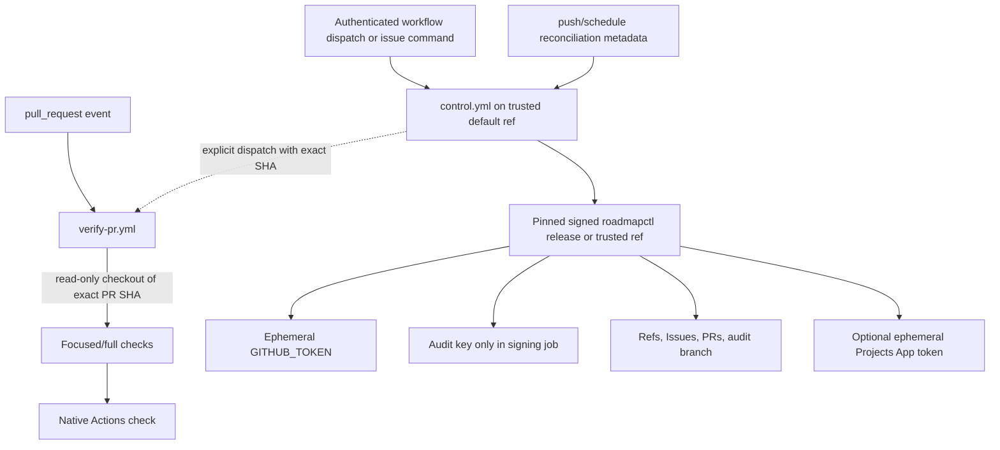

# GitHub Operations and Delivery

## CLI and agent adapters

`roadmapctl` is the only policy composition point for local users and adapters. Command groups expose read-only `plan/status/validate` operations separately from mutating `request/apply` operations. Every mutation displays repository, authenticated actor, canonical version, affected task/tracker, permissions, and expected refs before submitting authenticated intent.

Pi and OpenCode adapters are thin integrations that:

- negotiate adapter and optional Gentle AI capabilities by versioned capability IDs;
- set the verified task worktree as the session root;
- expose only granted operations and path scope;
- maintain an operation journal for quiescence and handoff;
- invoke `roadmapctl` for governed transitions; and
- install/update only sentinel-delimited managed instruction blocks.

The initial OpenAI profile is configuration consumed by adapters; model/provider choices do not enter core policy. Gentle AI rules are referenced by capability/version and never copied. Missing negotiation means the capability is unavailable, not implicitly granted. Direct shell/tool bypass has the same cooperative-host limitation as worktree isolation and is reported honestly.

## GitHub Actions topology and credentials

### Unprivileged workflows

Task, tracker, and release verification use separate reusable workflow entry points with explicit check sets. Pull-request jobs have `contents: read`, no privileged environment, no repository/App/signing secrets, and no write token available to executed pull-request code. They check out the exact event head/merge object and report which base/head object IDs were tested. Native `pull_request` runs use their Actions job result. Explicitly dispatched runs return content-bound evidence to a separate minimal status-publisher job that never checks out or executes candidate code and has only the check/status permission needed to bind the result to the exact head object. Fork pull requests remain untrusted and gain no upstream task authority.

All third-party actions are allowlisted and pinned to full commit SHAs. A static policy test rejects tags, mutable branches, `pull_request_target`, broad workflow permissions, secret references in unprivileged jobs, and checkout of an event-controlled ref in privileged jobs.

### Privileged workflows

Control jobs use `workflow_dispatch`, `repository_dispatch` where appropriate, trusted-branch `push`, and bounded scheduled reconciliation. They do not check out pull-request heads or execute repository scripts from them. Job permissions are minimal and split so a job that does not need contents/Issues/PR write does not receive it. The Ed25519 audit secret and Projects App key are available only to their dedicated privileged jobs.

`GITHUB_TOKEN` is ephemeral and repository-scoped. Its writes often suppress recursive workflow events. Therefore correctness never depends on a bot-created branch, commit, Issue edit, or pull request automatically triggering another workflow. The initiating control run explicitly invokes the next unprivileged `workflow_dispatch` with exact object IDs when immediate verification is needed, records the resulting run ID, and polls/continues through a later control invocation. A separate no-checkout status publisher binds successful content-bound verifier evidence to the candidate; it never accepts a candidate-authored verdict. Scheduled/manual reconciliation discovers any missed continuation. A dispatch is not proof of verification; only a completed verifier result and published check bound to the expected objects are evidence.

If GitHub rejects explicit dispatch or Actions cannot start, the operation remains pending/frozen. RoadmapControl does not replace required Actions checks with local claims.

### Optional Projects App

Projects synchronization is disabled by default. Enabling it requires an owner-confirmed private GitHub App installation. The App receives only the minimum Projects v2 organization/user project permissions and repository metadata access needed to resolve linked items; it receives no Contents/code write or pull-request merge permission. Its private key is an Actions secret, exchanged for a short-lived installation token inside the privileged synchronization job, and never sent to the CLI or PR workflows. Issue/PR writes continue to use `GITHUB_TOKEN` so Projects authority is not widened.

## Pull requests, verification, and exact line accounting

Each tracker has one system tracker branch and one draft pull request to the logical development branch. Each task has one normal pull request from its system task branch to its tracker branch, created only after authenticated user intent. Tracker approval requires every registered child task PR to have an authorized human approval on its current head and be merged into the tracker branch. Stale approvals do not count.

The normal 400-line gate is deterministic and content-bound:

1. Resolve the pull request's current base and head object IDs and compute their merge base.
2. Fetch those objects without checking out untrusted content in a privileged job.
3. Run Git's numstat diff with external diff/text conversion disabled and rename detection disabled over `merge-base..head`.
4. Sum decimal additions and deletions for every authored tracked text path, including source, tests, documentation, and configuration.
5. Exclude only generated golden paths declared by a protected, versioned generation manifest and reproduced byte-for-byte by the pinned generator. Keep every excluded golden path and blob ID in the complete candidate identity. An undeclared, stale, or non-reproducible generated file is counted as authored.
6. Treat binary/unreportable authored entries, missing objects, shallow history, submodule object changes, or parse ambiguity as `unknown`, which blocks the normal gate.
7. Record authored count, total diff count, excluded golden paths, path breakdown, merge-base, head ID, Git version, and algorithm version. Any head or effective base change invalidates the result.

A value of 400 authored lines passes; 401 does not. Disabling rename detection prevents a rename heuristic/version difference from changing the count. This may count a pure rename as deletion plus addition, intentionally favoring review load over optimistic classification. No whitespace, test, documentation, configuration, or ordinary generated-file exclusion exists. An over-budget or unknown result proceeds only through an owner-approved audit event bound to the exact object IDs, measured result, and indivisibility justification; changing the candidate invalidates the exception.

Focused task checks run against the task PR. Full suite plus tracker-outcome checks run on the integrated tracker object. Full suite, build, version policy, artifact digest, and logical-production mapping checks run on the exact release candidate. Even when development and production names resolve to one physical branch, the release aggregate still requires a separate authenticated human decision and audit event. Rollback is a new reviewed correction and version; no published ref is rewritten.
