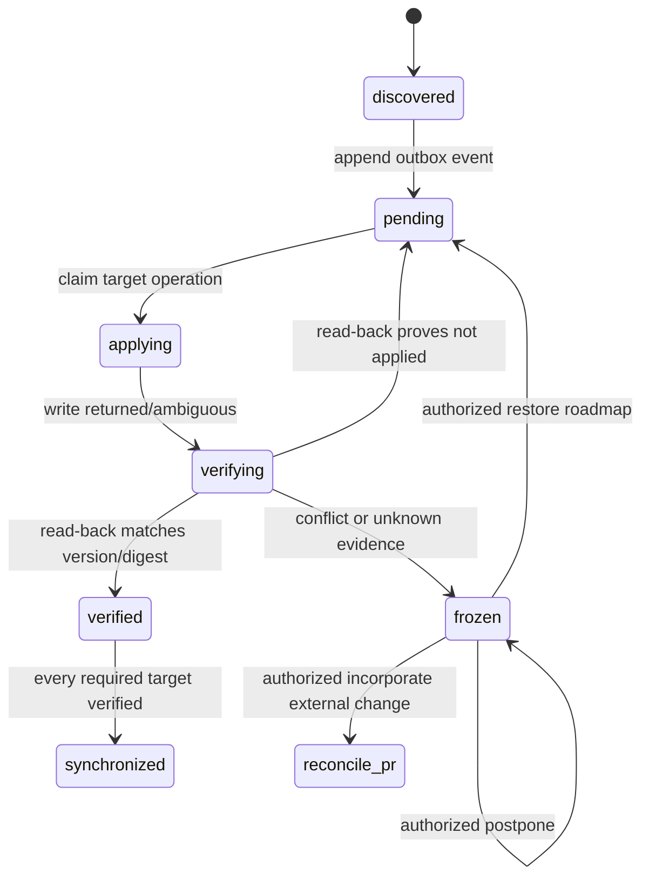

# Synchronization and Audit

## Synchronization, outbox, and idempotency

A roadmap merge and its GitHub projections cannot be atomic. RoadmapControl implements a durable saga on the audit branch and makes synchronization completeness an admission precondition.



For each merged `.roadmap/` version, the trusted control run appends an immutable outbox event keyed by merge commit ID. If `GITHUB_TOKEN` event suppression, quota exhaustion, or a crash prevents that append, admissions compare the canonical merge ID with the latest synchronized version and fail closed. Reconciliation later scans canonical history for missing merge IDs and emits the omitted outbox event exactly once.

Each projection operation has the idempotency key:

```text
SHA-256(repository-id | roadmap-version | target-kind | target-id | projection-schema)
```

Issue projections update only a sentinel-delimited managed section and version marker; comments, discussion, and evidence remain untouched. Project projections write only mapped derived fields. Before any retry, the adapter reads the target and classifies it as already applied, not applied, conflicting, or unknown. Because GitHub mutation APIs do not provide one transaction or uniform idempotency keys, an ambiguous result always goes to read-back; RoadmapControl never blindly repeats a write.

A target is `verified` only after read-back exactly matches the canonical fields, version marker, and projection digest. A roadmap version is `synchronized` only after all required Issues and the enabled Project are verified and that result is appended to the audit chain. Dependent work remains disabled before then.

Drift creates a freeze record for the smallest target/tracker scope whose isolation is proven. Shared or unknown dependencies expand the freeze, up to global. The only transitions are:

- restore the derived GitHub representation from the roadmap;
- create a roadmap pull request incorporating the external value; or
- postpone while leaving the scope frozen.

All require the applicable authenticated human authority and audit evidence. Exact state-only `in_progress` and `done` pull requests carry an expected roadmap digest and prior authorization ID; their diff validator rejects every other byte. They may auto-merge only while that authorization and digest remain current.

## Audit branch and key lifecycle

### Event format and chain

The orphan `roadmapcontrol/audit` branch contains immutable event files partitioned by sequence. Each canonical JSON event includes schema version, repository ID, monotonic sequence, event/operation ID, event type, actor identity and authority evidence, canonical roadmap/ref object IDs, timestamp supplied by the trusted control run, payload/evidence digests, previous event hash, and signing key ID.

```text
event_hash = SHA-256(canonical event without signature)
signature  = Ed25519.Sign(repository_private_key, event_hash)
```

Verification checks canonical encoding, payload/evidence hashes, signature, strict sequence, previous hash, key validity interval, and Git parent continuity. The Git commit itself need not expose the private key through Git signing; the event signature is the portable authority proof. Any mutation, insertion, reordering, invalid branch parent, or signature failure freezes privileged operations.

Hash chains cannot by themselves detect deletion of an unanchored suffix. RoadmapControl compares the audit tip with recorded canonical synchronization/installation anchors, GitHub control-run evidence, and any locally retained verified tip. On GitHub Free, a deliberate owner can rewrite all repository evidence; the system detects inconsistencies that remain but cannot guarantee prevention or detection after complete evidence destruction. Documentation must state this limit.

### Key creation and rotation

During confirmed installation, the local CLI generates a per-repository Ed25519 keypair. It commits only the public key and key ID to the initialization pull request. The private key is encrypted to GitHub's repository Actions public key and uploaded as a repository secret; it is never written to the repository, command output, SQLite, adapter context, or pull-request artifact. Local transient key material is zeroed/best-effort deleted after upload confirmation. The signing key grants no GitHub API permission.

Normal rotation is explicit and continuity-preserving:

1. Owner confirms repository and rotation intent.
2. CLI creates and uploads a new private secret and proposes the new public key through a pull request.
3. After human approval/merge, a privileged job uses the old key to sign a `key_rotation` event binding the new key and public-key digest.
4. The first new-key event references the rotation event; verification confirms both sides.
5. Only after read-back may the owner remove the old secret.

A missing or invalid private key blocks privileged auditable mutations. Loss of the old key cannot produce normal cryptographic continuity and requires an explicitly documented owner recovery/freeze procedure; it must not be mislabeled as rotation.
